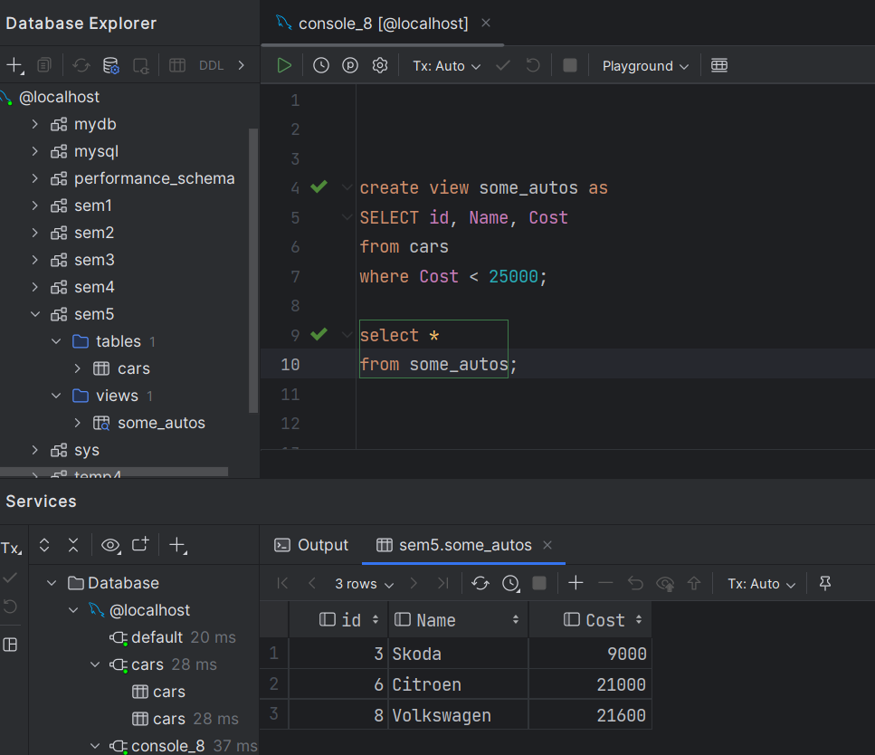
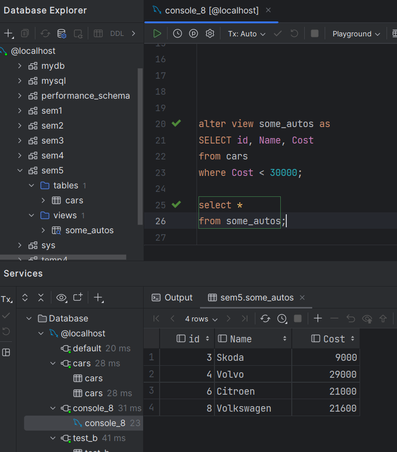
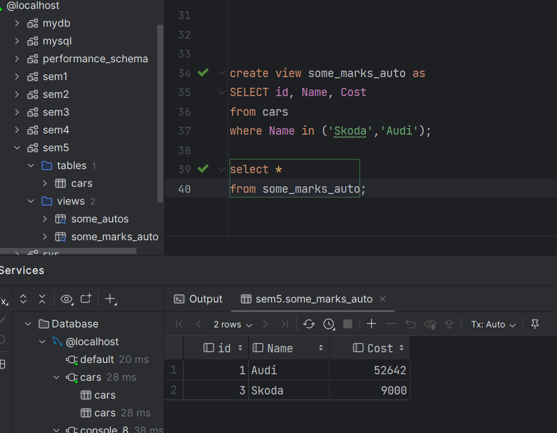
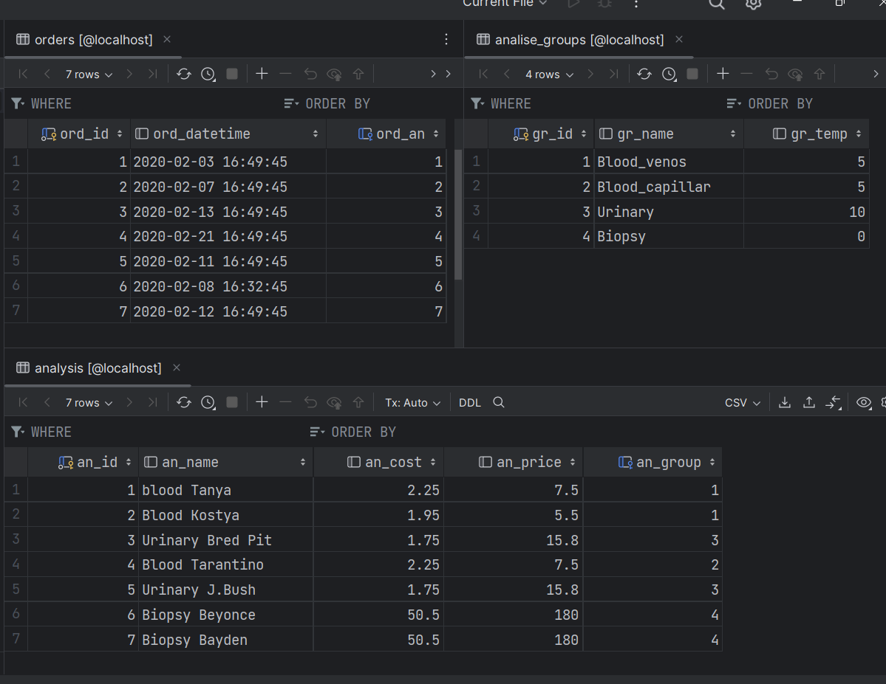
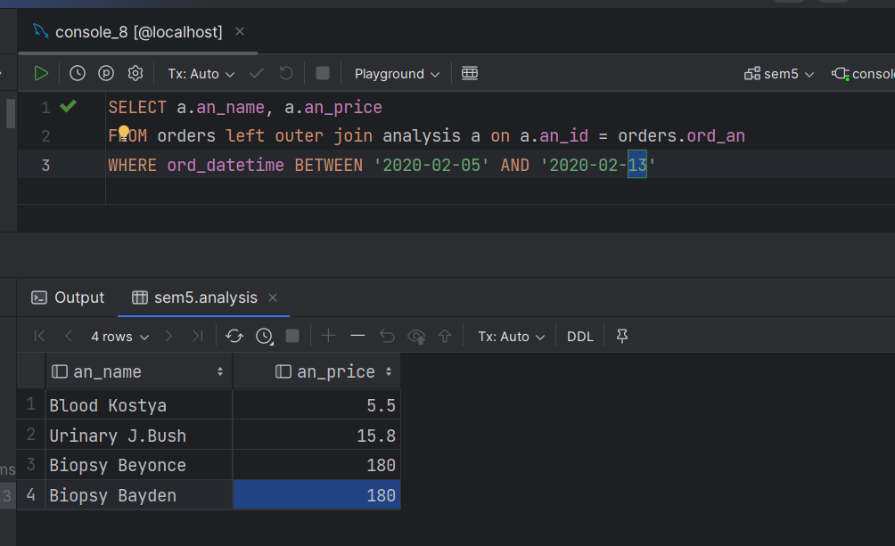
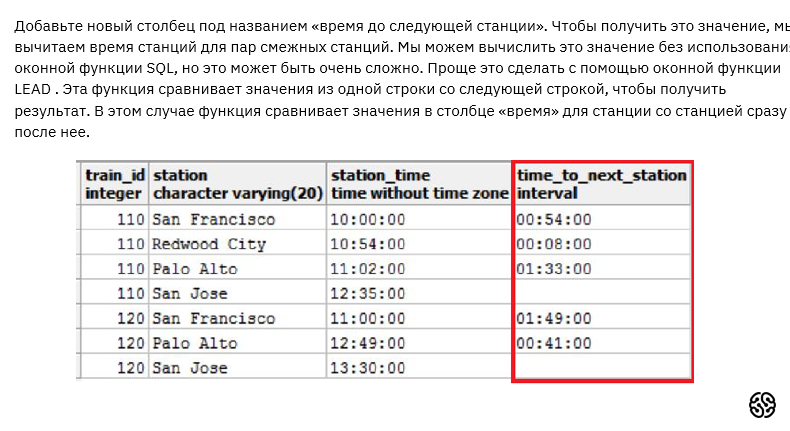
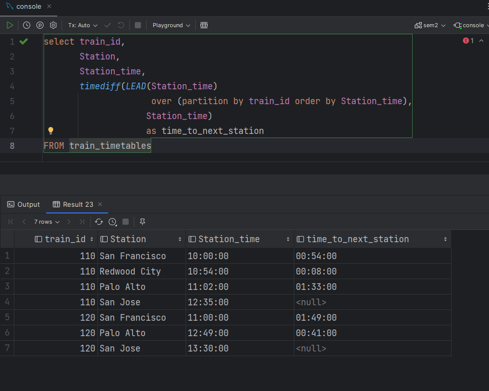

1. Создайте представление, в которое попадут автомобили стоимостью до 25 000 долларов

2. Изменить в существующем представлении порог для стоимости: пусть цена будет до 30 000 долларов (используя оператор ALTER VIEW)

3. Создайте представление, в котором будут только автомобили марки “Шкода” и “Ауди” (аналогично)

Вывести название и цену для всех анализов, которые продавались 5 февраля 2020 и всю следующую неделю.
Есть таблица анализов Analysis:
an_id — ID анализа;
an_name — название анализа;
an_cost — себестоимость анализа;
an_price — розничная цена анализа;
an_group — группа анализов.
Есть таблица групп анализов Groups:
gr_id — ID группы;
gr_name — название группы;
gr_temp — температурный режим хранения.
Есть таблица заказов Orders:
ord_id — ID заказа;
ord_datetime — дата и время заказа;
ord_an — ID анализа.

Создал и заполнил такие таблицы:

взял 13-ое - так как SQL явно берет начало дня 
Хотя вероятно стоило указать как 2020-02-12 23:59:59

